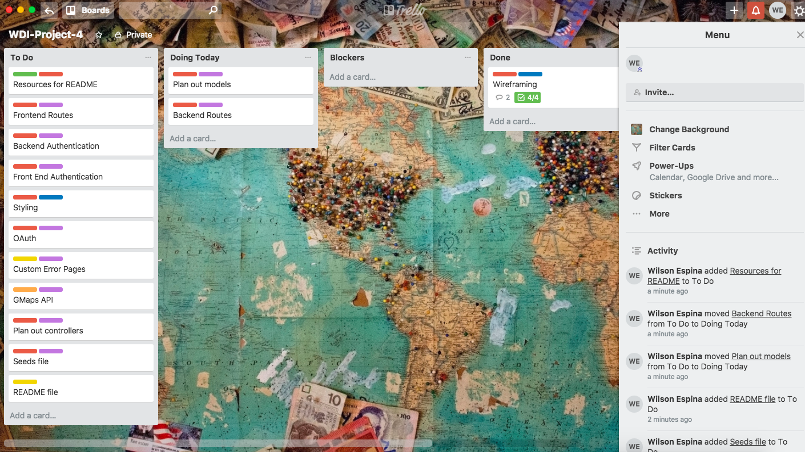
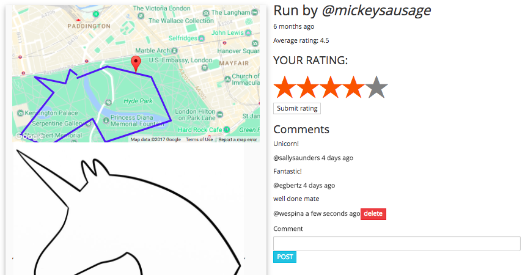

#  WDI Project 4: MERN Stack - 'TRACE'


**[https://running-trace.herokuapp.com/](https://running-trace.herokuapp.com/)**


## SUMMARY

My final project at General Assembly was to create a full MERN stack application with an open scope to create a RESTful site, achievable within a week. The site ended up being a social exercising platform which encourages people to compete and upload the best running traces they’ve saved on the social exercise app, [Strava](https://www.strava.com/). I combined map data received from the Strava API and with the Google Maps API to give a visual representation of run activities. 


### Programming and Technology Library:

* Mongo, Express, ReactJS, Node.js
* JSX
* JavaScript
* HTML5
* CSS3
* SASS
* Strava API
* Google Maps API
* Bootstrap
* webpack
* Chai
* Mocha
* react-stars 

## PLANNING

### Initial Idea

During the initial planning phase, I sketched out a fews ideas on paper and investigated the quality of information available from various APIs. I knew I wanted to create something linked to fitness and health and I found that Strava, an app I used regularly, happened to produce detailed JSON information from their API.

In my initial concept, I had originally planned for the app to based around people submitting any run traces and for the site's community to rate and comment on them. This idea progressed over time, with the  site suggesting predefined 'shapes' that people would try to copy with their runs.


> *Figure 1 - Concept sketch from initial ideas mapping*


### Project Planning

Throughout the project, I organised sprints by planning tasks on a  Trello board. All features were listed on cards and progressed through the 'To do', 'Doing Today' and 'Done' chain. Following Agile project management principals, I assigned a priority rating to each feature. Everything either had a 'Must Have', 'Should Have' or 'Could Have' rating allowing me prioritise what to work on.



> *Figure 2 - Trello board used to plan and monitor the project throughout the week*


### Wireframe and prototyping

After finalising the initial concept, I wire-framed the designs to help visualise the user experience journey and come up with the basic layouts for each page. I used Adobe Xd to both wireframe and prototype the concept, meaning that I had working button links. This made it easier to decide on what information was needed on each page.

My intention was to create a fully mobile responsive app so that users would be able to both plan out and view their run data when being outside. Adobe Xd allows users to open up the wireframe designs on your mobile which aided in the design process.


> *Figure 3 - Wire-framing and prototyping on Adobe Xd*


## FEATURES

### OAuth
My entire site is built around JSON data sent back by the Strava API. In order to access your own Strava data, the app requires OAuth, where most functionality is written in a back end controller:

```js
function strava(req, res, next) {

...

    .then(response => {
      const { athlete, access_token } = response;
      return User
        .findOne({ $or: [{ stravaId: athlete.id }, { email: athlete.email }] })
        .then((user) => {
          if(!user) {
            user = new User({
              name: `${athlete.firstname} ${athlete.lastname}`,
              username: `${athlete.username}`,
              image: `${athlete.profile}`
            });
          }
```
As part of the response sent back from the Strava website, the access token and data on the logged in user is sent back. The code above shows how a new instance of a new 'User' is generated and saved as part of the response meaning that this data can be accessed any time after a successful login. I used this info to populate the users show page (profile page) rather than having to make a full Axios request back to Strava.

### Average Ratings and Comments

The website includes the ability to rate and comment on submitted runs.I used a pre-made React component called 'reacts-stars' to handle the capturing the user's rating. The average rating calculation was carried out on the back end, in the run model and handled as a virtual. This means that as users populate the array of all the rating submitted, the functionality below calculate the average rating and passes it back automatically after each rating submission.

```js
runSchema
  .virtual('averageRating')
  .get(calculateRating);

function calculateRating() {
  if (this.ratings.length === 0) return 'TBC';

  let sum = 0;
  const ratings = this.ratings.map(rating => {
    sum += rating.value;
    return rating.value;
  });

  return parseFloat( (sum/ratings.length).toFixed(1) );
}

```

The comments feature allows people to leave a comment on submitted runs and is set up in a way that only allows a user to delete comments belonging to them.


> *Figure 4 - Average rating and comments*


## THE FINAL APP

The look and feel of the final app was intended to use a simple colour palette. Many of the pages use large images of people running to maintain the sporty theme throughout. i used Bootstrap to create a grid layout and tried to keep the styling simple on each page, with icons being added from the font-awesome site to add finer details


> *Figure 5 - Screenshots from the final product*

### Lessons Learned

As with any project, there were many issues I stumbled across and there were also many lessons to be learned as a take away including:

1. Try to understand what pages a user would need to see when a user initially logs in. At the beginning of the process, it took a while to completely get my head around how a user would interact with my site, i.e. first having a landing page, then moving onto the users show page.
2. A lot of functionality is much more suitable to be placed in the back end. Before starting, I was not fully aware of the process of creating virtual or being able to add data validation. However after including these features, it makes much more sense to do so.
3. I also learnt that when including Google Maps, they can be highly customisable. Through reading the Google documentation, I was able to a different coloured line for the 'trace' and was able to choose map styles via [snazzymaps](https://snazzymaps.com).


## FEATURES BACKLOG

Given a week-long timeframe, the scope of the project needed to be suitable and some planned features could not be included. In the future, I'll work on adding the following features to my site:

1. Make the entire site more mobile responsive.
2. Include multiple Google Maps styles and the functionality to be able to choose them on the users show page. At the moment, these are simply placeholder images.
3. Integrate waypoints selector feature on Google Maps to make the app more useable before recording a run.
4. Include the ability to access bike rides as well as runs.
5. Add extra styling features including rating stars instead of just numbers.
6. Adding additional comments functionality to make comments appear on either the left or right hand side of the comments box according to who has submitted the comment.
7. Front end testing using enzyme.
